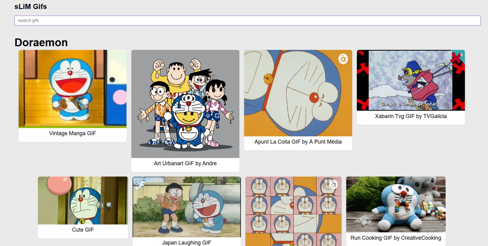

# sLiM Gifs
Search gifs on giphy.


## Clone and Install 
```shell
git clone https://github.com/sLiMFly/slim-gifs.git
yarn
```

## Run
```js
yarn dev
```

# Demo
https://slimfly.github.io/slim-gifs/
or
https://slimgifs.netlify.app

## Screenshots

<p align="center">
    
</p>


Ejercicio del curso de [Fernando Herrera](https://fernando-herrera.com/)
